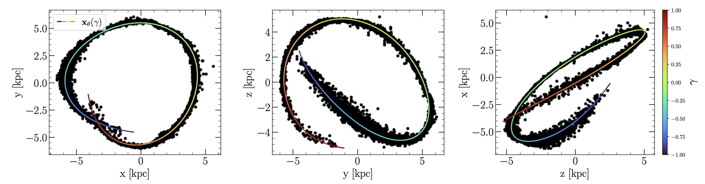
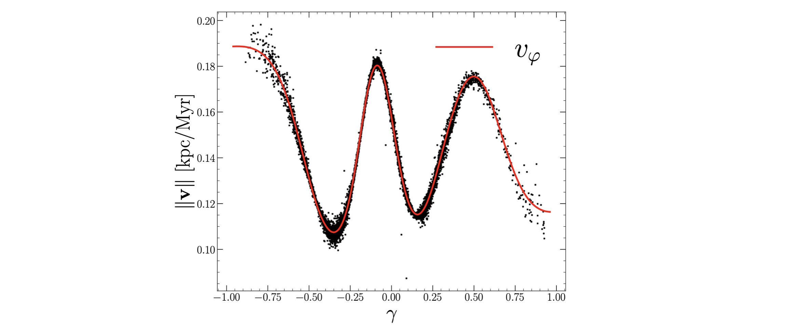
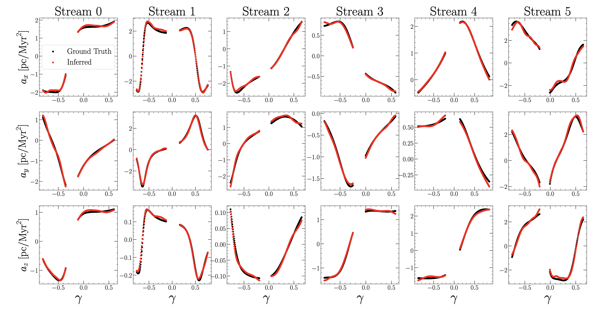
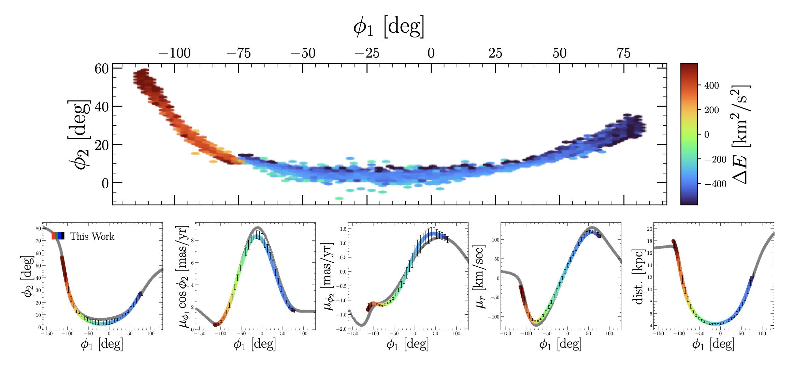
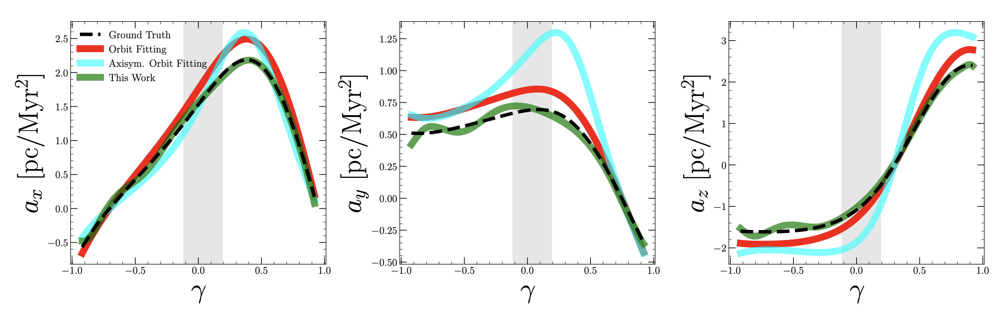
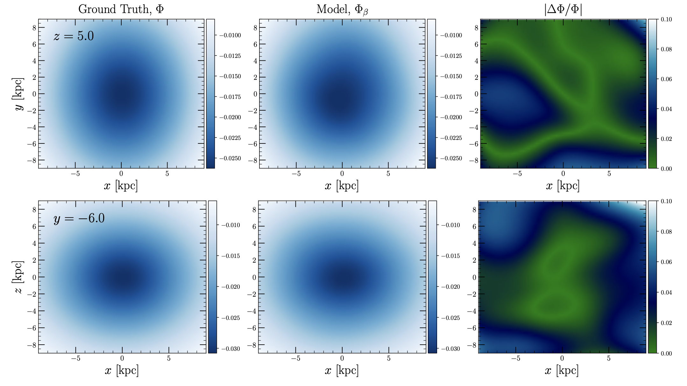

Paper Links: [arxiv:2205.11767](https://arxiv.org/abs/2205.11767), [ADS](https://ui.adsabs.harvard.edu/abs/2022arXiv220511767N/abstract)

*With Vasily Belokurov, Miles Cranmer, Jeremy Goodman, Shirley Ho*

## Stellar Streams 
Stellar streams are remnants of tidal disruption, when a satellite galaxy or globular cluster becomes torn apart by the tidal forces of the parent galaxy. The result is a field of "debris" that spreads out across the sky. The stream of debris roughly maintains the orbit of the parent cluster, providing us as observers with a snapshot of a single stellar orbit in the outskirts of the Milky Way. This is one of many reasons why stellar streams are so amazing! We are not around long enough to observe stars making substantial progress along their orbits in the galactic outskirts, but stellar streams give us a way in. 

## The Problem
We're interested in measuring the matter density of the Milky Way, both the baryonic and dark components. For streams in the outskirts of the Galaxy (called the stellar halo), dark matter dominates the mass-density. The dynamics and morphology of a stream provide a sensitive probe of the underlying matter distribution, and illuminates the dark matter distribution in the stellar halo. With streams, we not only want to unravel the formation history of the Milky Way, but we're also interested in questions like: what is the shape of the dark matter halo? Is it tilted with respect to the disk? Is there evidence for small-scale fluctuations in the dark matter density? Is the halo in equilibrium? There are several established and new methods that use streams to make progress on answering these questions. 

In our work, we introduce a new approach that requires minimal assumptions about the functional form of the dark matter density distribution. We do not rely on analytic models for the gravitional potential, and our method operates in the space of observables, rather than relying on a set of latent parameters. Our approach estimates galactic accelerations from streams directly and does not require an intermediate model for the gravitional potenital. In this way, we remain agnostic to the functional form of the potential. As a post-analysis step, a potential can be constrained that generates the estimated accelerations. Our approach enables highly localized measurements of the stellar halo in the neighborhood of a stream. Independent constraints can be stitched together, illuminating the Milky Way's unseen mass-density and providing a small-scale test of $\Lambda$CDM while reconstructing the Galaxy's history. Increased flexiblity is afforded by machine learning, which enables reconstruction of the galactic acceleration field from a fully data-driven standpoint.

## Orbital Structure 
While the morpohology and dynamics of a stream are _similar_ to a stellar orbit, streams are actually populated by many stars each with slightly different orbital properties. We can see this in the figure below, where a single, simulated stellar stream is plotted in angular coordinates in the plane of the sky (left).

In the right panel, the stars that belong to this stream are illustrated in the subspace of energy and angular momentum, relative to the progentior cluster from which the stream was generated. In this simulation, Energy and (z-)angular momentum are integrals of motion. This means that a $(E,L_z)$ pair characterizes a single stellar orbit [terms and conditions apply]. Stars with different energy and angular momentum will follow different orbits. Clearly, we can see that the stream is extended in this space: it is not a single orbit! While this is technically true, the above figure illustrates another interesting aspect underlying the dynamics of streams: stars are--on average--ordered by their energy and angular momentum relative to the progenitor. We illustrate this by color-coding the stars in the right panel by their position angle, $\phi_1$, along the stream. The progentor is shaded in grey. A coherent picture emerges: stars with the larger energetic differences relative to the progentior cluster tend towards the extended outskirts of the tidal tails. Stars with small energetic differences are closer in towards the progenitor.

This is not suprising: stars that are lost from the progentior with large energy differences will, over time, more readily move away from the gray cluster. Stars with similar initial conditions to the progentior's motion will tend to stick around for the ride. This means that _locally_, stars will typically fall along similar orbits within the stream. Two distinct regions of the stream seperated by a large $\Delta \phi_1$ will have larger orbital differences. But for small changes in $\Phi_1$, on average, stars will fall along approximately the same orbits. Under this view, streams are not a single orbit, but an ensemble of contigous orbital segments with a slowly evolving energy gradient between adjacent connections.  

## Central Assumption 

We can visualize this in the following way: Let's take a band of width $\Delta \phi_1$ and slide it along the stream. For each step, we'll plot the energy and angular momentum distribution in the band. We can see that there is a local distribution in energy and angular momentum for each $\phi_1$ band. However, the properties of that distribution evolve quite slowly, outside of the progenitor at least (around $\phi_1 \approx -35.5$). This brings us to the central assumption of our work: ***we assume that the distribution of stellar orbits in subsequent bands of $\Delta \phi_1$ evolves slowly along the stream.*** This means that, on average, stars fall along locally similar orbits at slightly different phase-angles along the stream. However, for distinct regions of the stream orbits will not necessarily have the same similarity. Indeed, for the idealized $N$-body case shown above, this is what occurs: nearby stars have similar energies, similar orbits.  
## Central Equations 
With this central assumption in mind, the next step is to model streams with the goal of learning something about the gravitational potential that the streams are evolving in. To accomplish this, we reduce each simulated stream in our analysis down to a 1-dimensional curve in phase-space, $(\boldsymbol{x}, \boldsymbol{v})$, where $\boldsymbol{x} \in \mathbb{R}^3$ is position and $\boldsymbol{v} \in \mathbb{R}^3$ is velocity. _If_ we could fit a flexible curve to a stream in these quantities, then it's not unreasonable to expect that derivatives of these quantities along the stream may be related to accelerations. That is, change in velocity over time. 

Reducing the stream down to a 1-dimensional curve means that we are parametrizing a path through phase-space. We parametrize the path in terms of a gauge-invariant scalar parameter called $\gamma$. This parameter will continually appear and can be viewed as a monotonic function that moves us along the stream of interest. For the stream we looked at earlier, $\gamma$ can be taken as $\phi_1$. Another post can be written about the $\gamma$ parameter and how it is determined, though let's put that off for now. The parametrized phase-space curve takes the form $(\boldsymbol{x}(\gamma), \boldsymbol{v}(\gamma))$. We assume that $\boldsymbol{x}$ and $\boldsymbol{v}$ are related through
\begin{equation}\label{eq: tang}
\boldsymbol{v}(\gamma) = \frac{\boldsymbol{x}^\prime(\gamma)}{\Vert \boldsymbol{x}^\prime(\gamma) \Vert} \Vert \boldsymbol{v}(\gamma) \Vert \equiv \boldsymbol{T}(\gamma) \Vert \boldsymbol{v}(\gamma) \Vert.
\end{equation}
There's another quantity that will be useful in a moment: the arc-length function $s(\gamma)$, with units of length. This function encodes the length of the parameterized curve $\boldsymbol{x}(\gamma)$ relative to some starting point. For a particle trajectory, $s$ is the integral of the speed of the particle against time. In our case we do not have time, but we have $\gamma$! So we define the arc-length as follows:
\begin{equation}\label{eq: path_length_gamma}
s(\gamma) = \int\limits_{0}^\gamma d\tilde{\gamma} \sqrt{\frac{d\boldsymbol{x}}{d\gamma} \cdot \frac{d\boldsymbol{x}}{d\gamma} },
\end{equation}
where the integrand is evaluated at $\tilde{\gamma}$. With this quantity on-hand, let's start taking some derivatives. First, because $\gamma$ is simply a montonic function encoding phase-angle along the stream, it is closely related to $s(\gamma)$ and has the same properties. So, we would have equally as well expressed the position and velocity as functions of $s$, arc-length. Of course, $s$ is itself a function of $\gamma$, so we're about to apply the chain rule:
\begin{equation}\label{eq:dvds}
    \frac{d\boldsymbol{v}}{ds} = \frac{d\boldsymbol{v}}{dt}\frac{dt}{ds} = \frac{d\boldsymbol{v}}{dt}\left(\frac{ds}{dt}\right)^{-1} = \boldsymbol{a}\left(\frac{ds}{dt}\right)^{-1},
\end{equation}
where the second to last equality is from the inverse function theorem, and $\boldsymbol{a}$ is the acceleration vector. $ds/dt$ is simply the speed: or the change in arc-length over time as a particle is perturbed from its current position. Using Eq. \ref{eq:dvds}, this implies 
\begin{equation}\label{eq: prelim_a}
    \boldsymbol{a} = \frac{d\boldsymbol{v}}{ds} \Vert{\boldsymbol{v}}\Vert.
\end{equation}
Because we have expressed $s$ a function of $\gamma$ (Eq. \ref{eq: path_length_gamma}), we can also apply the chain rule through the parameter $\gamma$:
\begin{equation}
    \frac{d\boldsymbol{v}}{ds} = \frac{d\boldsymbol{v}}{d\gamma}\frac{d\gamma}{ds} = \frac{d\boldsymbol{v}}{d\gamma}\left(\frac{ds}{d\gamma}\right)^{-1}.
\end{equation}
Substituting this into Eq. \ref{eq: prelim_a}, we have
\begin{equation}\label{eq: a_prelim}
    \boldsymbol{a} = \frac{d\boldsymbol{v}}{d\gamma}\left(\frac{ds}{d\gamma}\right)^{-1} \Vert{\boldsymbol{v}}\Vert{}.
\end{equation}
By the fundamental theorem of integral calculus, $ds/d\gamma$ is simply the integrand of Eq. \ref{eq: path_length_gamma}. This relation allows us to express the full 3-dimensional acceleration vector along the stream as a function of the scalar parameter $\gamma$:
\begin{equation}\label{eq: acceleration_eqn}
    \boldsymbol{a}(\tilde{\gamma}) = \frac{d\boldsymbol{v}}{d\gamma}\Big\vert_{\tilde{\gamma}} \left(\frac{d\boldsymbol{x}}{d\gamma}\Big\vert_{\tilde{\gamma}}  \cdot \frac{d\boldsymbol{x}}{d\gamma}\Big\vert_{\tilde{\gamma}}  \right)^{-1/2} \Vert \boldsymbol{v}(\tilde{\gamma}) \Vert
\end{equation}
where $\tilde{\gamma}$ is an evaluation point. In summary, we have used the chain rule to eliminate explicit time-dependent and estimate accelerations along the path of the stream. This is enabled by assuming that the positions and velocities are coupled through Eq. \ref{eq: tang}, which follows from our assumption that stars fall along locally similar orbits at slightly different phase-angles across the stream. 

## Fitting Simulated Streams in a Ground Truth Potential

Each stream in our work is fit using a flexible neural network to estimate $\boldsymbol{x}(\gamma)$ and $\boldsymbol{v}(\gamma)$. A sample fit to a simulated stream is shown above, where the scatter points represent stars in the space of cartesian positions $(x,y,z)$ and the colorful curve is our neural network derived stream track. The curve is color-coded by the $\gamma$-value, which encodes position along the stream. We also fit the speed along the stream using a neural network, illustrated below.

## Estimating Accelerations
Now, once the differentiable phase-space curve $(\boldsymbol{x}(\gamma), \boldsymbol{v}(\gamma))$ is fit, we use Eq. \ref{eq: acceleration_eqn} directly to estimate "a slice" through the galactic acceleration field along a stream. 

This is precisely what the figure above shows for six simulated streams: each column is a distinct stream, while each row is a different acceleration component $\boldsymbol{a} = (a_x, a_y, a_z)$. Black points indicate the ground truth accelerations along our parametrized curve, and red shows our estimate. As illustrated in the main figure at the top of this post, we estimate accelerations subject to the regularization condition that rapid changes in $\boldsymbol{a}$ should be minimized. That is, we penalize neural network parameters that give rise to noisy estimates of the acceleration field. 

Across the streams analyzed in this work, we recover the correct accelerations with high accuracy. Fractional errors are typical at the percent to sub-percent level, with exceptions towards the outer regions of each stream where the quality of the derivative estimate suffers (beyond the tidal tails, there are no data to estimate derivatives). The gaps in the above plot correspond to the location of the progenitor, which is removed in our analysis. 

## Energy Gradients
We started this post by discussing that streams are not actually perfect orbits. Instead, they have a small range in energies. We illustrate the ability of our approach to capture this property of streams in the figure below.

Here, we have plotted a single stream in angular coordinates, though color-coded by the mean energy in each $\phi_1, \phi_2$ bin. In the bottom row, we plot our fit to the stream in the space of position angles, proper motions, and galactocentric distance. All the quantities are shown as a function of $\phi_1$. We shade our parametrized curve by its energy in the ground truth potential, using the same color-scale as in the top row. Comparing segments in $\phi_1$ between the two figures, we recover the local energy gradient of the stream while also estimating the underlying acceleration field to high accuracy. Evidently, our method is flexible enough to treat streams as an ensemble of locally similar and globally distinct orbital mixtures. This is distinct from orbit-fitting algorithms, since treating a stream as an orbit imposes an isoenergy constraint. 

## Comparison

We compared our work to orbit-fitting of stellar streams, which assumes that the tidal debris delineates a constant energy curve (i.e., an orbit) in the correct galactic potential. Of course, when fitting orbits one needs to adopt a potential to integrate the orbits in. Because the potential is not an observable quantity, it is conceivable that the analytic form that the user adopts could be biased from the truth. We compare our method to such a case above, where we plot accelerations derived from three distinct cases for estimating accelerations. The black-dashed curve depicts the ground truth acceleration field, the red curve corresponds to orbit fitting a stream under the correct functional form for the potential, the cyan curve adopts the wrong functional form, and the green curve corresponds to our new method. Because we do not require a model for the gravitational potential, we override the possibility of adopting a wrong functional form. We also do not require streams to delineate orbits, so our method typically outperforms orbit fitting even when the correct potential is used. 

## Reconstructing the Potential
Once accelerations are estimated, we can _then_ think about what potential might be consistent with the measured accelerations. This is inherently different from previous potential reconstruction methods in general, since a functional form for the potential is almost always adopted before any analysis even begins. Constraining a potential from accelerations is straightforward, since we have the relation $\boldsymbol{a} = -\nabla \Phi$, where $\Phi$ is the gravitational potential. We start by constraining an analytic model for the gravitational potential, dependent on five parameters. The posterior distribution on the model parameters is shown below, where we have used estimated accelerations from the 6 stellar streams shown earlier to constrain the parameters.

Grey lines indicate the true parameter values. From only six streams, our method provides an accurate estimate of the underlying parameters that characterize the halo of our mock galaxy. 

We have estimated galactic accelerations using a new flexible method based on a neural-network-based fit to the dynamics of stellar streams. It is interesting to consider how constraints from individual streams can be combined and interpolated across systems to construct a data-driven global constraint on the mass distribution of the Galaxy. We apply this exercise to the six stellar streams discussed before and use a neural network to represent a flexible potential. We train the neural network through its gradient, tuning model parameters until $\nabla \Phi = - \boldsymbol{a}$. Poisson's equation provides us with a useful physically motivated prior, that promotes positive mass densities. That is, we tune neural network parameters to satisfy $\nabla^2 \Phi \geq 0$, while also remaining compatible with the data.  

The result of this exercise is shown above, where we plot two slices through the mock galaxy. The top row is at constant $z$, while the bottom is at constant $y$. The neural network is the middle column and appears largely indistinguishable compared to the model (first column). From six streams, the neural network interpolates over unseen regions, and constrains the global potential by stitching together constraints from independent streams while minimizing non-physical artifacts in unseen regions of the galaxy. The neural network knows nothing of the symmetries/asymmetries of the potential and discovers this itself from the estimated accelerations. 

## Outlook
We have formulated a new approach for estimating galactic accelerations with stellar streams. Our method is data-driven and does not require intermediate models for the galactic potential. Because our analysis operates in phase-space, it is easily extendable to streams with missing phase-space dimensions. While this was not the subject of the current paper, it is ongoing work. The time-dependence of the Milky Way potential poses some challenges to our assumptions, though this work provides a useful basis for developing related methods that do not require slowly evolving potentials. Perhaps more interestingly, this work demonstrates explicitly that streams provide a highly localized view of the galactic halo, and our method enables local estimates of the dark matter distribution in the vicinity of a number of Milky Way streams. There are exciting prospects for applying this method to real data from (e.g.) _Gaia_ in a future work, but that's for another day... Do see the paper for many more details!

